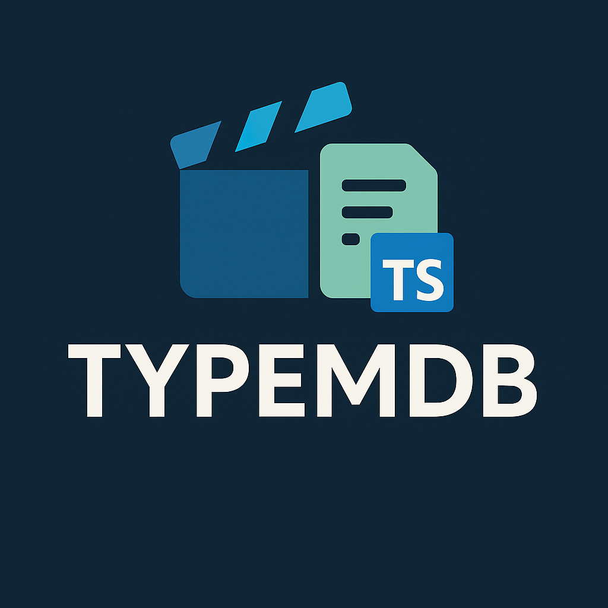

# Tmdbts: A TypeScript Client for The Movie Database (TMDb) API

- [Tmdbts: A TypeScript Client for The Movie Database (TMDb) API](#tmdbts-a-typescript-client-for-the-movie-database-tmdb-api)
  - [✨ Features](#%E2%9C%A8-features)
  - [🚀 Installation](#%F0%9F%9A%80-installation)
  - [📚 Usage](#%F0%9F%93%9A-usage)
  - [🏗️ API Structure](#%F0%9F%8F%97%EF%B8%8F-api-structure)
  - [⚙️ Configuration](#%E2%9A%99%EF%B8%8F-configuration)
  - [🚫 Error Handling](#%F0%9F%9A%AB-error-handling)
  - [🤝 Contributing](#%F0%9F%A4%9D-contributing)
  - [📄 License](#%F0%9F%93%84-license)

<p align="center">
  
  <br>
  <em>A type-safe TMDb API client for Node.js and browsers</em>
</p>

`Tmdbts` is a robust and modular TypeScript client library designed to make
interacting with The Movie Database (TMDb) API simple and efficient. It
provides a structured, type-safe way to access various TMDb endpoints, from
fetching movie and TV show details to managing user accounts and handling authentication.

---

## ✨ Features

- **Comprehensive API Coverage**: Access a wide range of TMDb endpoints, including
  Account, Authentication, Certifications, Changes, Collections, Companies, Credits,
  Discover, Genres, and Guest sessions.
- **Type-Safe**: Built with TypeScript, offering excellent type inference and
  autocompletion for a smoother development experience.
- **Modular Design**: Each API category is encapsulated in its own module,
  promoting clean code and easy navigation.
- **Promise-Based**: All API calls return Promises, making it easy to handle
  asynchronous operations with `async/await`.

## 🚀 Installation

You can easily add `Tmdbts` to your project using `pnpm`:

```bash
pnpm install tmdbts

npm install tmdbts

yarn add tmdbts

bun add tmdbts
```

## 📚 Usage

To get started with `Tmdbts`, you'll first need a TMDb API key. If you don't have
one, you can easily obtain it by registering on the [TMDb website](https://developer.themoviedb.org/reference/intro/authentication).

Here's a basic example demonstrating how to initialize and use the `Tmdbts`
client to fetch some data:

```typescript
import { Tmdbts } from "tmdbts";

const API_KEY = "YOUR_TMDB_API_KEY"; // ⚠️ Replace with your actual TMDb API key!

async function fetchData() {
  try {
    const tmdb = new Tmdbts({ apiKey: API_KEY });

    // Example 1: Get authenticated account details
    const accountDetails = await tmdb.account.getDetails();
    console.log("Account Details:", accountDetails);

    // Example 2: Discover the most popular movies
    const popularMovies = await tmdb.discover.findMovie({
      sort_by: "popularity.desc",
      page: 1,
    });
    console.log(
      "Popular Movies:",
      popularMovies.results.map((movie) => movie.title),
    );

    // Example 3: Retrieve movie certifications for the US region
    const movieCerts = await tmdb.certifications.getMovieCertifications();
    console.log("US Movie Certifications:", movieCerts.certifications.US);
  } catch (error) {
    console.error("An unexpected error occurred:", error);
    // You can specifically check for TmdbError instances for API-specific issues
    // if (error instanceof TmdbError) {
    //   console.error('TMDb API Error:', error.message, error.original);
    // }
  }
}

fetchData();
```

---

## 🏗️ API Structure

The `Tmdbts` client is meticulously structured to mirror the TMDb API's own
organization, making it incredibly intuitive to navigate and find the methods
you need.

> [!TIP]
> I highly recommend using this library alongside the official themoviedb
> [API Reference](https://developer.themoviedb.org/reference/intro/getting-started).
> All endpoints within `Tmdbts` are grouped in the same logical way as they are
> documented by TMDb.

```typescript
/* prettier-ignore */
new Tmdbts({ apiKey: '...' })
  .account // Methods related to user accounts
  .auth    // Authentication and session management
  .certifications // Movie and TV show certifications
  .changes // Tracking changes in movies, TV shows, and people
  .collection // Movie collections
  .company // Company information
  .credit  // Credit details
  .discover // Discovering movies and TV shows
  .genres  // Movie and TV show genres
  .guest // Guest session related data
// ... and more!
```

---

## ⚙️ Configuration

When initializing `Tmdbts`, you can provide a `TmdbConfig` object to customize its
behavior. This allows you to set your API key, override the base URL, add
custom headers, or define default query parameters for all requests.

```typescript
interface TmdbConfig {
  /** Your TMDb API key (required) */
  apiKey: string;

  /**
   * Base API URL (default: 'https://api.themoviedb.org/3/')
   * Useful for testing or proxying
   */
  baseUrl?: string;

  /** Custom headers to include with all requests */
  headers?: Record<string, string>;

  /** Default query parameters for all requests */
  defaultParams?: {
    language?: string; // ISO 639-1 code (e.g., 'en-US')
    region?: string; // ISO 3166-1 code (e.g., 'US')
    // ... other params
  };
}
```

Example:

```typescript
const tmdb = new Tmdbts({
  apiKey: "YOUR_API_KEY",
  baseUrl: "https://api.themoviedb.org/3/", // This is the default, but you can
  override it for testing or proxying
  headers: {
    "X-Powered-By": "Tmdbts-Client", // Add a custom header
  },
  defaultParams: {
    language: "fr-FR", // Set default language for all requests
    region: "FR", // Set default region
  },
});
```

---

## 🚫 Error Handling

All API methods in `Tmdbts`are promise-based and will reject with an error if
something goes wrong during the API call (e.g., network issues, invalid API key,
TMDb server errors). The library is designed to throw a custom `TmdbError` for
API-specific issues, allowing you to catch and handle them gracefully.

```typescript
class TmdbError extends Error {
  statusCode?: number; // HTTP status code from the TMDb API response
  original?: unknown; // Stores the original underlying error object (e.g.,
  AxiosError instance)
  // Additional properties might be added to provide more context about the API error.
}
```

---

## 🤝 Contributing

Contributions are always welcome! If you'd like to contribute to `Tmdbts`, please
follow these steps:

1. Fork the repository.
2. Create a new branch for your feature or bug fix:
   `git checkout -b feature/your-feature-name` (for new features)
   or `git checkout -b bugfix/fix-description` (for bug fixes).
3. Make your changes, ensuring code quality and adherence to existing patterns.
4. Write tests for your changes to ensure everything works as expected and
   prevents regressions.
5. Commit your changes with a clear and concise message using `pnpm commit`.
6. Push your branch to your forked repository: `git push origin feature/your-feature-name`
7. Open a **Pull Request** to the main repository, detailing your changes and
   referencing any related issues.

---

## 📄 License

This project is released under the [MIT](./LICENSE).

---
